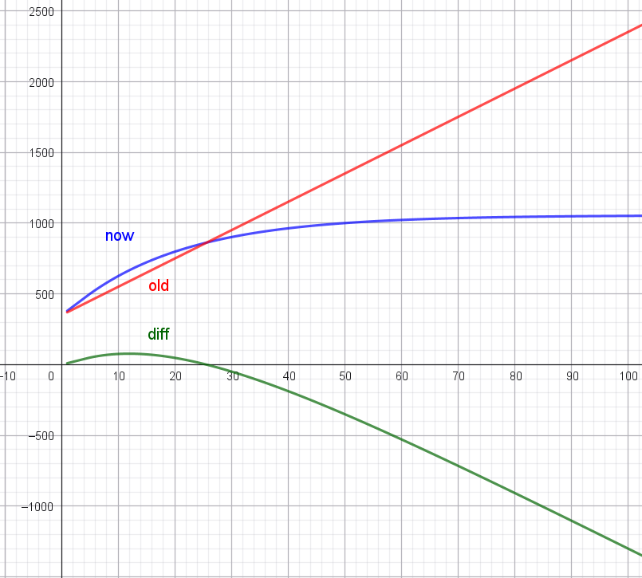
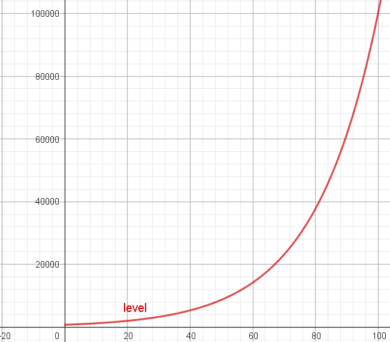

# LittleMouseAdventure
**这是一个使用 Pygame 开发的简易 RPG 游戏，包含战斗、养成、抽卡、存档等功能。所有代码均为 Python 脚本，结构清晰，适合学习或扩展。**


文件说明
```bash
main.py	         游戏主入口，包含主循环、事件处理、状态切换和绘制调度。
constants.py	   定义所有常量，如屏幕尺寸、颜色、字体、游戏状态、按钮尺寸、抽卡概率等。
ui.py	           所有绘制函数，包括菜单、战斗、养成、抽卡等界面的绘制。
handlers.py	     输入处理函数，处理鼠标点击事件，并根据当前状态调用相应的逻辑函数。
battle.py	       战斗逻辑，包含玩家攻击、玩家技能（治疗）、敌人攻击等函数。
levels.py	       关卡数据，根据关卡编号生成对应的敌人数据。
upgrade.py	     养成逻辑，包括使用经验书和技能书的函数。
gacha.py	       抽卡逻辑，包含角色池定义和抽卡函数（消耗金币）。
save.py	         存档与读档功能，使用 JSON 文件保存游戏进度。
```


运行说明
安装 Python 3.12+ 和 Pygame 库：
```bash
pip install pygame
```


运行 main.py：
```bash
python main.py
```

游戏操作
鼠标点击按钮进行选择

ESC 键返回上一级菜单

游戏特性
战斗系统：攻击、治疗、敌人 AI

角色养成：升级、学习技能

抽卡系统：消耗金币随机获得新角色

存档系统：自动保存和手动保存

## 更新日志 ##
### **Update TEST_0.5.1_alpha -2026.3.13** ###
✨ 优化

战斗ui优化

⚙️ 游戏逻辑调整

升级经验系统更新、技能经验系统更新.

攻击性技能等级对角色加成如下



等级所需经验变化如下




### **Update TEST_0.5_alpha -2026.3.11** ###
⚙️ 战斗逻辑调整

添加嘲讽值逻辑、技能大重做
### **Update TEST_0.3_alpha -2026.3.10** ###
✨ 优化

战斗动画优化 战斗逻辑更改 怪物站位从硬编码→level.py 单独设计每一关的站位

优化主界面UI  战斗UI

角色文件大更新：现在可以通过character包里面每个文件定义每个角色了。
### **Update  TEST_0.2_alpha -2026.3.9** ###

⚙️ 战斗逻辑调整

添加速度战斗逻辑
### **Update  TEST 0.1.2 alpha -2026.3.8** ###
✨ 新增功能
上阵系统：现在可以管理最多5名角色同时上阵，只有上阵的角色才会参与战斗。

养成界面滚动：当角色数量超过6个时，可以通过鼠标滚轮滚动查看所有角色。

上阵状态标识：在养成界面中，上阵角色的按钮边框显示为金色，待命角色为白色。

上阵切换按钮：在养成界面右侧详细信息区域，新增“设为上阵/待命”按钮，点击可切换角色的上阵状态，并自动检查上阵人数上限（最多5人）。

养成界面滚动条：当角色数量超过6个时，可使用鼠标滚轮滚动查看所有角色。

⚙️ 战斗逻辑调整
战斗界面现在仅显示和操作上阵角色，未上阵角色不会出现在战斗中。

敌人攻击仅针对上阵且存活的角色。

🔧 功能调整
战斗机制优化：

攻击和治疗仅作用于存活角色，死亡角色不再参与伤害计算或接受治疗。

敌人攻击时自动跳过已死亡角色，避免无效攻击。

界面简化：移除战斗界面底部的“ESC 返回选关”文字提示（因为已有“逃跑”按钮和ESC全局返回），减少冗余信息。

ESC全局返回增强：在确认界面按ESC键也可返回选关界面，与点击“返回”按钮行为一致。

🐛 问题修复
修复养成界面经验书、技能书、抽卡界面和上阵切换按钮无响应的问题（按钮坐标与检测区域不一致）。

修复战斗界面滚轮滚动误触攻击按钮的问题（通过过滤滚轮按键事件）。

修复闯关模式左下角同时存在两个返回主菜单元素的问题（删除了多余的ESC提示文字）。

修复养成界面返回主菜单按钮无法使用的问题（完善了事件处理逻辑）。

修复我方角色一名阵亡之后导致游戏结束、敌人鞭尸的情况。

📦 数据兼容性

存档文件中新增 active 字段（布尔值）记录每个角色的上阵状态。旧存档加载时会自动将前5个角色设为上阵，其余设为待命。


